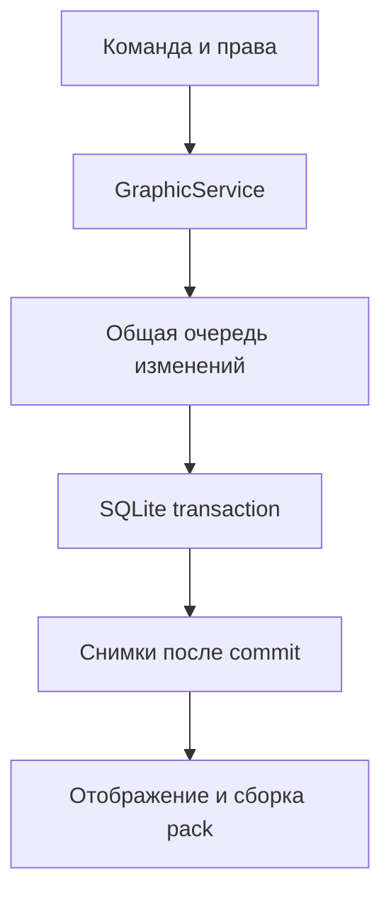

# Архитектура TabPrefix 2.6.0

91 production Java-файл. Composition root — `bootstrap/PluginRuntime`; entry point — `me.snowsun.tabprefix.TabPrefix`. Сборка ориентирована на Java 8 и Bukkit API 1.16.5 как compile baseline; различия 1.12–1.21.11/26.x реализованы runtime-адаптерами. Bukkit/NMS API не встраиваются в плагин.

## Слои

| Пакет под `me.snowsun.tabprefix` | Реализация |
|---|---|
| `domain` | Неизменяемые assets, drafts, текст/формат, снимки, pack revision, состояния доставки |
| `application` | `PrefixService`, `GraphicService`: сериализация изменений, транзакционные результаты и публикация кэша |
| `application.port` | Хранилища префиксов/графики, группы, audit, main thread и управление runtime |
| `config` | Строгий YAML, defaults, immutable settings; чистый `FeatureSettings.Source` и Bukkit-адаптер `YamlSettings` |
| `infrastructure.persistence` | JDBC, schema 3, подготовленные SQL-запросы, транзакции и bounded SQLite worker |
| `infrastructure.media` | ImageIO, GIF composition, EXIF, transforms, immutable media folders, quota/GC/dedup |
| `infrastructure.resourcepack` | Атласы, font JSON, детерминированный ZIP, SHA-1, active metadata, rollback и очередь сборки |
| `infrastructure.web` | Встроенный HTTP, session registry, Bearer API, редактор, private media и public pack routes |
| `infrastructure.audit` | Параметры получателей, последние записи, ротация и очередь файловой записи |
| `infrastructure.luckperms` | Публичный LP API, контексты, primary/weighted group, callbacks |
| `infrastructure.bukkit` | Main-thread dispatcher, NativeTabAccess, адаптеры старого/современного TAB, header/footer и resource packs |
| `presentation.command` | Аргументы, права, readiness, completion и пользовательские сообщения |
| `presentation.display` | Кэш кадров, TAB, teams, чат, join/quit и подтверждение загрузки pack |
| `presentation.message` | Adventure/MiniMessage, legacy, policy, unparsed placeholders и typed URLs |
| `util` | Безопасные пути, digest, атомарные файлы, ограниченные workers |

Domain и application не импортируют Bukkit, LuckPerms, Adventure или JDBC. Тяжёлые операции адаптеров идут вне Bukkit thread. HTTP не вызывает Bukkit API напрямую; сервисы возвращают futures, аудит передаёт уведомления через main-thread dispatcher.

## Транзакционный путь применения

`PrefixService` сериализует текстовые и графические изменения общей очередью до 128 операций. `GraphicService` использует `PrefixService.commitExternal` для полного снимка graphics/texts. При применении SQLite проверяет код, TTL, single-use, владельца и группу; назначает недостающие glyphs, заменяет graphic/text записи и отмечает код использованным в одной транзакции. Снимки публикуются только после успешного завершения. Недостаток codepoints или любая SQL-ошибка откатывают весь переход, включая употребление кода.

Сохранение в web editor создаёт неизменяемый черновик и код, не меняет активную группу. Настройки single-use/bind сохраняются вместе с кодом; изменение конфигурации не ослабляет уже созданные коды. В базе хранится SHA-256 кода, а сессионный реестр хранит SHA-256 токенов.

## Schema 3

| Таблица | Данные |
|---|---|
| `group_text_prefixes` | Текст, формат, группа, автор и время |
| `assets` | UUID контента, реальный формат, ячейка, метрики шрифта, задержки и время |
| `asset_glyphs` | Asset/frame → уникальный codepoint, непрерывные индексы кадров |
| `group_visual_prefixes` | Группа → asset, автор и время; asset может быть NULL |
| `editor_drafts` | UUID, владелец, неизменяемая группа/asset/text, TTL |
| `save_codes` | Хэш → draft, flags single-use/bind, used_at |
| `admin_preferences` | UUID → вывод журнала в чат |

`PRAGMA user_version=3`. Инициализация мигрирует версии 1 и 2, сохраняя текстовые записи. Schema 3 также хранит документ Display Studio, его ревизию и настройки получателей. Более новая схема вызывает отказ запуска без понижения. Каждый SQLite вызов владеет соединением и закрывает его; WAL, foreign_keys, synchronous NORMAL и busy_timeout 2000 ms задаются явно. Работает один SQL worker с очередью 256.

Следующий glyph определяется по MAX(codepoint)+1. После первого применения назначение сохраняется навсегда. Удалённый групповой префикс не позволяет переиспользовать его codepoints. Cleanup удаляет только assets без назначений, групп и действующих ссылок на drafts; expired tombstones удерживаются до суток. Неназначенные assets получают период ожидания не менее часа. В media каждый asset — отдельный UUID-каталог с original, options и PNG frames; запись выполняется через staging и atomic move. Хэш файлов и задержек позволяет повторно использовать идентичный asset.

## Media и pack

Декодер проверяет сигнатуру/реальный ImageIO format, размеры и бюджет pixels до построения кадров. GIF применяет logical canvas, frame offsets, restoreBackground/restorePrevious и прозрачность; delays квантуются в ticks. Transform выполняет EXIF, crop, rotation/flips, resize/fit и цветовую коррекцию. При tick уже не декодируются изображения.

PackBuilder сортирует glyphs и ZIP entries, группирует providers по font height/ascent и помещает uniform cells на PNG pages. В bitmap chars используются назначенные codepoints и нулевые placeholders пустых ячеек. Генерируются `minecraft/font/default.json` и namespaced font. ResourcePackFormat выбирает формат по версии сервера, включая major/minor min_format/max_format с 1.21.9. На 1.12 font providers не включаются. Матрица — COMPATIBILITY.md. Инициализация пересобирает pack другого формата из сохранённых assets; rollback несовместимого формата отклоняется. Полностью записанный ZIP публикуется с SHA-1, затем атомарно обновляется `active.json`. Незавершённая сборка не заменяет active revision.

ResourcePackService объединяет повторные запросы сборки и повторяет её при изменениях во время работы. Rollback использует сохранённый проверенный ZIP, восстанавливает активную revision и не откатывает SQL группы. Старые файлы удерживаются по keep-old-packs; отправленная revision дополнительно защищается от очистки на пять минут.

## Потоки и отображение

| Работа | Поток/ограничение |
|---|---|
| Lifecycle, команды, LP identity, TAB/teams и отправка сообщений | Bukkit main thread |
| SQL | Один worker, очередь 256 |
| HTTP | По умолчанию 4 workers, очередь 64 |
| Image processing | Один worker, очередь 8 |
| Pack build | Один serial worker с объединением rebuild |
| Maintenance | Один worker; нет параллельных cleanup |
| Audit file | Один worker, очередь 256 |
| Async chat | Чтение immutable cached prefix; графическая доставка через main thread |

LP callbacks добавляют только отслеживаемые online UUID; повторы незагруженного LP пользователя ограничены. Scheduler объединяет dirty targets/viewers, выбирает готовый glyph по времени и отправляет PlayerInfo display updates пакетами отдельно каждому зрителю. Никаких SQL/ImageIO/LP запросов на каждый кадр. JSON имён кэшируется ограниченным LRU; NMS components создаются для отправки. NativeTabAccess определяет старый versioned пакет, unversioned Spigot или Mojang имена. CraftChatMessage разбирает JSON, старые серверы имеют serializer fallback. На современных записях копируются поля canonical entry с заменой только display name; при ошибке остаётся глобальный текстовый TAB.

`PackRequestState` хранит loaded/pending/queued отдельно для игрока. До SUCCESSFULLY_LOADED новый asset скрыт от этого получателя. Одновременно отправляется один pack. Старые события не имеют revision ID; современные ответы дополнительно проверяются по стабильному UUID resource pack, снятие касается только собственных packs. Timeout не сбрасывает pending, чтобы поздний ответ не подтвердил другую revision. Новый pack ждёт завершения или переподключения.

NameTagView меняет только собственные teams, ограничивает prefix до 64 UTF-16 без разрыва RGB/суррогатов и восстанавливает принадлежащий ему scoreboard. Общий scoreboard использует графику только если все зрители загрузили asset. Чат сохраняет format и recipients события; графическая строка выбирается отдельно получателю, консоль получает текстовую часть.

## HTTP и конфигурация

Статические ресурсы редактора встроены в JAR. Token 256-bit находится во fragment ссылки; API получает его в Authorization Bearer. Сессия привязана к владельцу и группе, новая сессия отзывает предыдущую. Клиент не задаёт целевую группу. Есть TTL, session/request/mutation limits, bounded bodies и одна мутация на сессию. CSP использует локальные ресурсы; тексты рендерятся через DOM textContent, без вставки HTML. Private media требуют token; pack endpoint доступен публично и поддерживает HEAD, Range, ETag. Маршруты не открывают SQLite или произвольные файлы.

YAML candidate полностью проверяется до reload. Недостающие ключи читаются из bundled defaults. Storage paths, HTTP binding/addresses, glyph geometry/range, atlas geometry и формат кодов требуют restart. Неправильный candidate сохраняет старую конфигурацию. Prefix text проверяется также после MiniMessage rendering: `<newline>` не обходит запрет управляющих символов.

## Жизненный цикл

Startup: YAML/platform → LP service → SQLite → text/graphic caches → audit → media verification → pack load/build → main-thread HTTP/listeners/display/ready. Ошибка обязательной части отключает плагин. Ошибка bind HTTP регистрируется, текстовое отображение остаётся доступным.

Shutdown прекращает HTTP и sessions, unregister listeners, отменяет tasks, восстанавливает TAB/teams, закрывает LP subscriptions, pack/maintenance/audit, сервисы и SQLite, затем message service. Dispatcher отбрасывает поздние callbacks после остановки. Runtime владеет всеми созданными компонентами.

## Доставка ответов команд (2.0.1)

MessageService использует `CommandSender.sendMessage(String)` для обычных ответов игроков, консоли, RCON и command blocks. Компоненты сначала рендерятся с текущей политикой и сериализуются в legacy RGB. Interactive components для игроков преобразуются в JSON и затем в BaseComponent серверного Bungee API; `Player.spigot().sendMessage(SYSTEM, ...)` сохраняет click/hover без зависимости от audience registry и без изменения server Gson. При RuntimeException/LinkageError используется прямой текстовый fallback с читаемым URL и одним предупреждением без tokens. После close доставка прекращается; offline callbacks пропускаются.

`doctor` требует status permission, выводит plain report напрямую и пишет его в серверный лог для игрового отправителя. В консоли вывод не дублируется. Команда работает до readiness и независимо от custom message templates.

## Сетевые адреса (2.0.2)

LocalNetwork перечисляет активные IP интерфейсов и сравнивает реальные prefix lengths с IP игрового соединения. WebAddresses хранит фактический binding/порт, кэширует интерфейсы до трёх секунд и ограничивает временные UUID choices 512 записями с TTL два часа. Входящие строки адреса принимаются только при наличии такого адреса в списке сервера. Discovery и clock допускают подстановку в детерминированных тестах. Пароли Wi-Fi/SSID не собираются.

EditorServer выполняет bounded bind retry только при BindException и только без явных внешних адресов. Listening state устанавливается после успешного start, failure сохраняется для команд/doctor, close освобождает HTTP и choices. Runtime запускает binding после верификации media и перед pack initialize/rebuild, вне Bukkit main thread. PackBuilder получает base через supplier, PackDelivery выбирает URL для конкретного получателя. Выданные сессии получают собственный Origin выбранной ссылки; POST проверяет этот Origin, CORS не открывается.

## Оформление 2.4

DisplayDesign — неизменяемый валидированный документ, PlayerDisplaySettings — настройки получателя. DisplayService выполняет последовательные SQL commits и проверяет revision. DisplayController читает снимки и работает только на главном потоке Bukkit. HTTP-права и предпросмотр проверяются через MainThreadDispatcher; редактор не обращается к Player с HTTP-потоков.

BossBarView владеет отдельными unkeyed Bukkit BossBar для получателя. Стабильный id сохраняет объект при обновлении; порядок меняется удалением/повторным добавлением собственных полос. BossBarProgress разделяет вычисления заполнения и таймеров между сервером и предпросмотром. Ротация выбирает только разрешённые полосы; таймеры каждой полосы начинаются при выполнении её условий, сохраняются при ротации и не запускаются автоматически после завершения hideAfter. Native flags меняются дифференциально, чужие бары не перечисляются. Независимый pulse обновляет анимированные боссбары раз в два тика без обновления остальных дисплеев. Старые JSON-поля получают значения по умолчанию; новая миграция SQLite не требуется.

SidebarView использует стабильный objective, уникальные невидимые entries и собственные teams; чужой sidebar имеет приоритет. DisplayBoards создаёт личные boards из пустого vanilla board, отслеживает замену сторонним плагином и возвращает прежний board только при сохранении владения. NameTagView не забирает игрока из чужой team. Header/footer отслеживаются и восстанавливаются отдельно через HeaderFooterAccess; на 1.12 используется native packet и нельзя читать сторонние header/footer. Sidebar использует двухаргументную регистрацию objective и отдельный title setter; лимиты title/team зависят от версии. TextRenderer понижает RGB до стандартных цветов на 1.12–1.15.

VirtualTabPackets создаёт 80 synthetic profiles с пустыми team names и именами !tp000…!tp079, которые сортируются перед обычными именами. Реальные player info entries сохраняются в кэше клиента; их UUID и game modes не меняются. Отправляются только изменённые entries; отключение удаляет только synthetic UUID. NativeTabAccess поддерживает legacy action packets и современные update/remove packets, mutable/immutable authlib profiles. В современных synthetic entries заполняются listed, list order и showHat; public key/chat session остаются пустыми. При ошибке включается обычный TAB. Фактическое поведение клиента требует проверки на живом сервере.

TabFormatting разделяет сортировку и typed suffix/name composition. Cached LP identity содержит context-aware prefix/suffix и weight выбранной группы; `/api/display/groups` отдаёт только загруженные группы под правом design. NormalTabView владеет per-viewer snapshots и глобальным Bukkit text fallback, не отправляет неизменённые имена. DisplayController объединяет name tags и обычную сортировку на owned teams с именами `tp` + пятизначная позиция + девять UUID-символов; чужие entry teams не меняются. При личном отключении сортировки remaining name-tag teams упорядочиваются по имени. Анимируемые суффиксы/общий формат запускают обновления раз в два тика независимо от refreshTicks; статический TAB дополнительных pulses не вызывает.

## Native HUD и автономные группы (2.6)

`NativeHudLayout` описывает неизменяемые профили геометрии, private codepoints и advances. `NativeHudFonts` строит bitmap-провайдеры из измеренных PNG и ограничивает физическую ячейку 256×256. Большие вертикальные смещения используют масштабирование. Горизонтальное размещение составляется подписанными пробелами; каждый блок возвращает суммарный advance к нулю. Обычные цифры и основной текстовый шрифт не заменяются.

`PackBuilder` сохраняет layout в `tabprefix-hud.json` внутри ZIP. При рестарте `ResourcePackService` восстанавливает manifest, а при изменении геометрии объединяет запросы пересборки. `PackDelivery` разрешает canvas только после успешного статуса загрузки подходящего pack. `DisplayController` сверяет профили с текущим дизайном; пока они не совпадают, панель без цифр выводится в TAB footer. Классический objective существует только в режиме NATIVE.

LuckPerms указан в `softdepend`. `LuckPermsBridge` выбирает лениво загружаемый `LuckPermsApiAdapter` либо собственный источник групп по правам `tabprefix.group.<group>`, порядку Studio и группе default. Автономный путь не требует LP API в classpath.

Локальные `workbench.css` и `workbench.js` задают общий стиль редакторов, темы, SVG-значки, поиск и пресеты. Canvas и обычные anchors используют один валидируемый документ; браузер не меняет протокол Minecraft. Ограничения и запасные пути описаны в [NATIVE-HUD.md](NATIVE-HUD.md).
