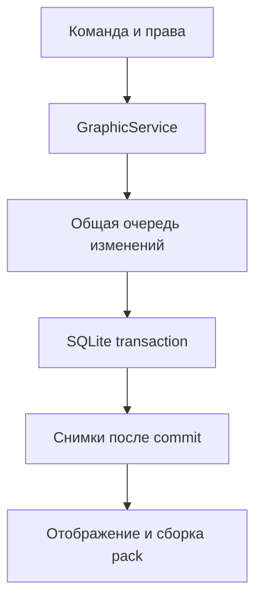

# Архитектура TabPrefix 2.0.1

66 production Java-файлов. Composition root — `bootstrap/PluginRuntime`; entry point — `me.snowsun.tabprefix.TabPrefix`. Сборка ориентирована на Java 8 и Bukkit API 1.16.

## Слои

| Пакет под `me.snowsun.tabprefix` | Реализация |
|---|---|
| `domain` | Неизменяемые assets, drafts, текст/формат, снимки, pack revision, состояния доставки |
| `application` | `PrefixService`, `GraphicService`: сериализация изменений, транзакционные результаты и публикация кэша |
| `application.port` | Хранилища префиксов/графики, группы, audit, main thread и управление runtime |
| `config` | Строгий YAML, defaults, immutable settings; чистый `FeatureSettings.Source` и Bukkit-адаптер `YamlSettings` |
| `infrastructure.persistence` | JDBC, schema 2, подготовленные SQL-запросы, транзакции и bounded SQLite worker |
| `infrastructure.media` | ImageIO, GIF composition, EXIF, transforms, immutable media folders, quota/GC/dedup |
| `infrastructure.resourcepack` | Атласы, font JSON, детерминированный ZIP, SHA-1, active metadata, rollback и очередь сборки |
| `infrastructure.web` | Встроенный HTTP, session registry, Bearer API, редактор, private media и public pack routes |
| `infrastructure.audit` | Параметры получателей, последние записи, ротация и очередь файловой записи |
| `infrastructure.luckperms` | Публичный LP API, контексты, primary/weighted group, callbacks |
| `infrastructure.bukkit` | Main-thread dispatcher и reflection-адаптер per-viewer TAB для R1/R2/R3 |
| `presentation.command` | Аргументы, права, readiness, completion и пользовательские сообщения |
| `presentation.display` | Кэш кадров, TAB, teams, чат, join/quit и подтверждение загрузки pack |
| `presentation.message` | Adventure/MiniMessage, legacy, policy, unparsed placeholders и typed URLs |
| `util` | Безопасные пути, digest, атомарные файлы, ограниченные workers |

Domain и application не импортируют Bukkit, LuckPerms, Adventure или JDBC. Тяжёлые операции адаптеров идут вне Bukkit thread. HTTP не вызывает Bukkit API напрямую; сервисы возвращают futures, аудит передаёт уведомления через main-thread dispatcher.

## Транзакционный путь применения

`PrefixService` сериализует текстовые и графические изменения общей очередью до 128 операций. `GraphicService` использует `PrefixService.commitExternal` для полного снимка graphics/texts. При применении SQLite проверяет код, TTL, single-use, владельца и группу; назначает недостающие glyphs, заменяет graphic/text записи и отмечает код использованным в одной транзакции. Снимки публикуются только после успешного завершения. Недостаток codepoints или любая SQL-ошибка откатывают весь переход, включая употребление кода.

Сохранение в web editor создаёт неизменяемый черновик и код, не меняет активную группу. Настройки single-use/bind сохраняются вместе с кодом; изменение конфигурации не ослабляет уже созданные коды. В базе хранится SHA-256 кода, а сессионный реестр хранит SHA-256 токенов.

## Schema 2

| Таблица | Данные |
|---|---|
| `group_text_prefixes` | Текст, формат, группа, автор и время |
| `assets` | UUID контента, реальный формат, ячейка, метрики шрифта, задержки и время |
| `asset_glyphs` | Asset/frame → уникальный codepoint, непрерывные индексы кадров |
| `group_visual_prefixes` | Группа → asset, автор и время; asset может быть NULL |
| `editor_drafts` | UUID, владелец, неизменяемая группа/asset/text, TTL |
| `save_codes` | Хэш → draft, flags single-use/bind, used_at |
| `admin_preferences` | UUID → вывод журнала в чат |

`PRAGMA user_version=2`. Инициализация добавляет таблицы к версии 1, сохраняя текстовые записи. Более новая схема вызывает отказ запуска без понижения. Каждый SQLite вызов владеет соединением и закрывает его; WAL, foreign_keys, synchronous NORMAL и busy_timeout 2000 ms задаются явно. Работает один SQL worker с очередью 256.

Следующий glyph определяется по MAX(codepoint)+1. После первого применения назначение сохраняется навсегда. Удалённый групповой префикс не позволяет переиспользовать его codepoints. Cleanup удаляет только assets без назначений, групп и действующих ссылок на drafts; expired tombstones удерживаются до суток. Неназначенные assets получают период ожидания не менее часа. В media каждый asset — отдельный UUID-каталог с original, options и PNG frames; запись выполняется через staging и atomic move. Хэш файлов и задержек позволяет повторно использовать идентичный asset.

## Media и pack

Декодер проверяет сигнатуру/реальный ImageIO format, размеры и бюджет pixels до построения кадров. GIF применяет logical canvas, frame offsets, restoreBackground/restorePrevious и прозрачность; delays квантуются в ticks. Transform выполняет EXIF, crop, rotation/flips, resize/fit и цветовую коррекцию. При tick уже не декодируются изображения.

PackBuilder сортирует glyphs и ZIP entries, группирует providers по font height/ascent и помещает uniform cells на PNG pages. В bitmap chars используются назначенные codepoints и нулевые placeholders пустых ячеек. Генерируются `minecraft/font/default.json` и namespaced font. Pack format — 5 для 1.16–1.16.1, 6 для 1.16.2–1.16.5. Полностью записанный ZIP публикуется с SHA-1, затем атомарно обновляется `active.json`. Незавершённая сборка не заменяет active revision.

ResourcePackService объединяет повторные запросы сборки и повторяет её при изменениях во время работы. Rollback использует сохранённый проверенный ZIP, восстанавливает активную revision и не откатывает SQL группы. Старые файлы удерживаются по keep-old-packs; отправленная revision дополнительно защищается от очистки на пять минут.

## Потоки и отображение

| Работа | Поток/ограничение |
|---|---|
| Lifecycle, команды, LP identity, TAB/teams и отправка сообщений | Bukkit main thread |
| SQL | Один worker, очередь 256 |
| HTTP | По умолчанию 4 workers, очередь 64 |
| Image processing | Один worker, очередь 8 |
| Pack build | Один serial worker с объединением rebuild |
| Maintenance | Один worker; нет параллельных cleanup |
| Audit file | Один worker, очередь 256 |
| Async chat | Чтение immutable cached prefix; графическая доставка через main thread |

LP callbacks добавляют только отслеживаемые online UUID; повторы незагруженного LP пользователя ограничены. Scheduler объединяет dirty targets/viewers, выбирает готовый glyph по времени и отправляет PlayerInfo display updates пакетами отдельно каждому зрителю. Никаких SQL/ImageIO/LP запросов на каждый кадр. JSON имён кэшируется ограниченным LRU; NMS components создаются для отправки. Reflection использует пакет класса EntityPlayer, поддерживая CraftBukkit R1/R2/R3; при ошибке остаётся глобальный текстовый TAB.

`PackRequestState` хранит loaded/pending/queued отдельно для игрока. До SUCCESSFULLY_LOADED новый asset скрыт от этого получателя. Одновременно отправляется один pack: в API 1.16 отсутствует revision ID ответа. Timeout не сбрасывает pending, чтобы поздний ответ не подтвердил другую revision. Новый pack ждёт завершения или переподключения.

NameTagView меняет только собственные teams, ограничивает prefix до 64 UTF-16 без разрыва RGB/суррогатов и восстанавливает принадлежащий ему scoreboard. Общий scoreboard использует графику только если все зрители загрузили asset. Чат сохраняет format и recipients события; графическая строка выбирается отдельно получателю, консоль получает текстовую часть.

## HTTP и конфигурация

Статические ресурсы редактора встроены в JAR. Token 256-bit находится во fragment ссылки; API получает его в Authorization Bearer. Сессия привязана к владельцу и группе, новая сессия отзывает предыдущую. Клиент не задаёт целевую группу. Есть TTL, session/request/mutation limits, bounded bodies и одна мутация на сессию. CSP использует локальные ресурсы; тексты рендерятся через DOM textContent, без вставки HTML. Private media требуют token; pack endpoint доступен публично и поддерживает HEAD, Range, ETag. Маршруты не открывают SQLite или произвольные файлы.

YAML candidate полностью проверяется до reload. Недостающие ключи читаются из bundled defaults. Storage paths, HTTP binding/addresses, glyph geometry/range, atlas geometry и формат кодов требуют restart. Неправильный candidate сохраняет старую конфигурацию. Prefix text проверяется также после MiniMessage rendering: `<newline>` не обходит запрет управляющих символов.

## Жизненный цикл

Startup: YAML/platform → LP service → SQLite → text/graphic caches → audit → media verification → pack load/build → main-thread HTTP/listeners/display/ready. Ошибка обязательной части отключает плагин. Ошибка bind HTTP регистрируется, текстовое отображение остаётся доступным.

Shutdown прекращает HTTP и sessions, unregister listeners, отменяет tasks, восстанавливает TAB/teams, закрывает LP subscriptions, pack/maintenance/audit, сервисы и SQLite, затем message service. Dispatcher отбрасывает поздние callbacks после остановки. Runtime владеет всеми созданными компонентами.

## Доставка ответов команд (2.0.1)

MessageService использует `CommandSender.sendMessage(String)` для обычных ответов игроков, консоли, RCON и command blocks. Компоненты сначала рендерятся с текущей политикой и сериализуются в legacy RGB. Interactive components для игроков преобразуются в JSON и затем в BaseComponent серверного Bungee API; `Player.spigot().sendMessage(SYSTEM, ...)` сохраняет click/hover без зависимости от audience registry и без изменения server Gson. При RuntimeException/LinkageError используется прямой текстовый fallback с читаемым URL и одним предупреждением без tokens. После close доставка прекращается; offline callbacks пропускаются.

`doctor` требует status permission, выводит plain report напрямую и пишет его в серверный лог для игрового отправителя. В консоли вывод не дублируется. Команда работает до readiness и независимо от custom message templates.
